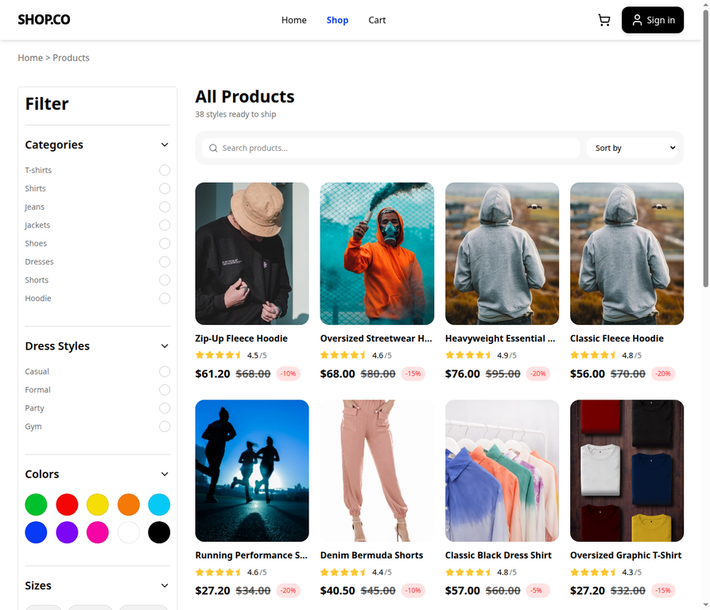
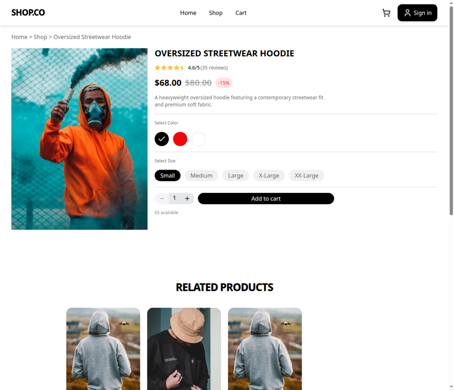
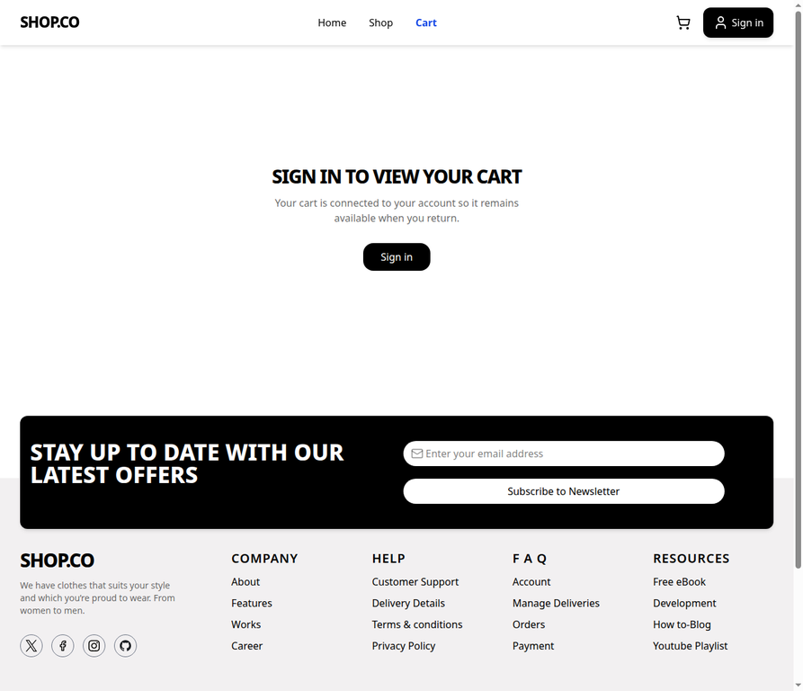
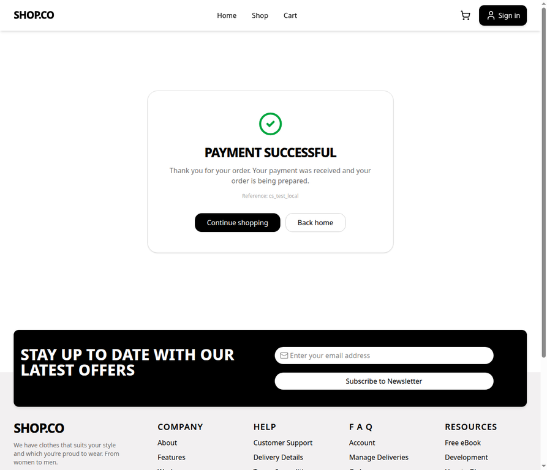
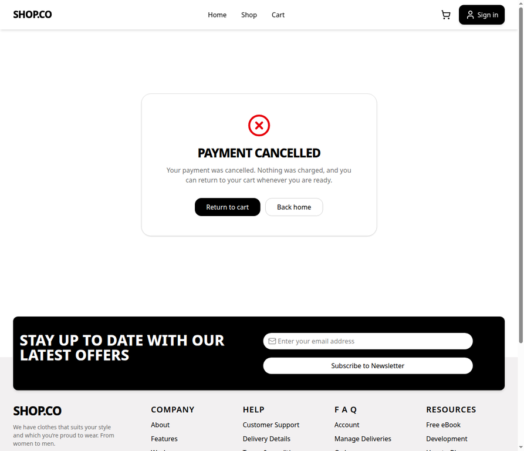
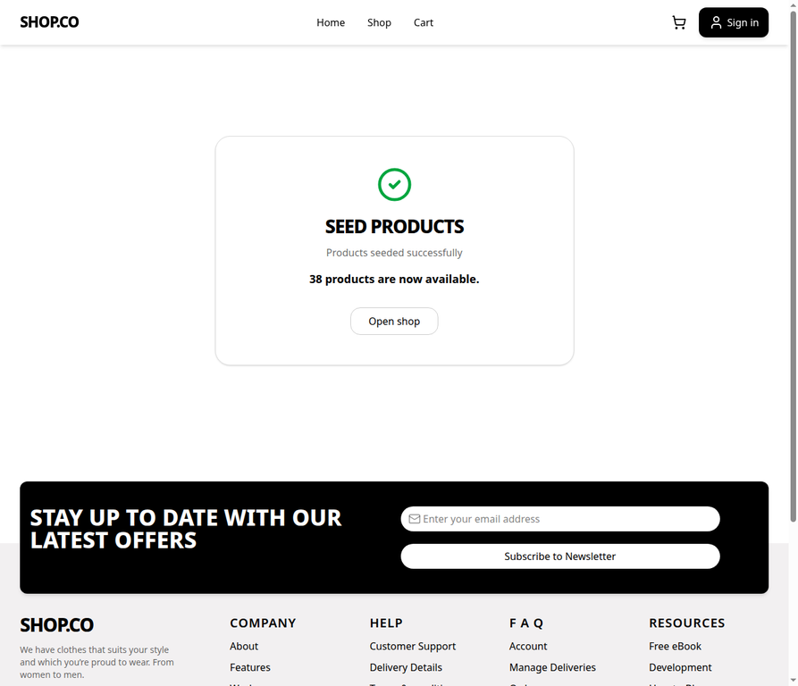

# SHOP.CO

<div align="center">
  
  <h3>Modern fashion commerce, from discovery to checkout.</h3>
  <p>A full-stack e-commerce experience built with React, Express, MongoDB, Redux Toolkit, and Stripe.</p>
  <p>
    <a href="https://github.com/aihamjassar/shop-co">Repository</a>
    ·
    <a href="https://github.com/aihamjassar/shop-co/issues">Issues</a>
  </p>
</div>


## Overview

**SHOP.CO** is a full-stack fashion storefront focused on a clean shopping journey: discover products, refine the catalog, inspect product variants, add items to a persistent account-based cart, apply discounts, and complete checkout through Stripe. The repository also includes an administrative dashboard for managing products, users, and orders.

The project is organized as a React/Vite client and an Express/MongoDB API. The frontend communicates with the backend through Axios and uses Redux Toolkit for authentication and cart state. Product images are designed to work with Cloudinary, while the catalog seed provides realistic local development data with remote image URLs.

## Product experience

| Area | Included functionality |
| --- | --- |
| Storefront | Responsive landing page, product discovery, product cards, sorting, filters, pagination, and dress-style navigation. |
| Product details | Image gallery, price and discount display, ratings, colors, sizes, stock availability, quantity controls, related products, and add-to-cart flow. |
| Cart | Account-based cart loading, quantity updates, item deletion, empty-cart handling, subtotal calculation, coupon validation, and discount display. |
| Checkout | Stripe Checkout session creation with success and cancellation result pages. |
| Authentication | Access and refresh token flow, protected account features, and role-aware dashboard access. |
| Dashboard | Product, user, order, account, and overview screens for administrators. |
| Development tools | Repeatable product seed, local `/seed` browser route, favicon, and visual screenshots in `client/screenshots/`. |

## Screenshots

### Storefront and catalog

The landing page presents the brand identity, hero section, featured product collections, style categories, and customer-focused content.


The shop page combines catalog browsing with category, style, color, size, price, search, sorting, and pagination controls.



### Product details and cart journey

The product details view brings together product imagery, variant selection, quantity management, stock information, and the primary add-to-cart action.



The cart route provides a clear sign-in state for users who have not authenticated yet and preserves the same visual language as the storefront.



### Checkout results and local seed flow

The checkout result pages make the next action explicit after a Stripe redirect, whether payment succeeds or is cancelled.

| Payment successful | Payment cancelled |
| --- | --- |
|  |  |

The local seed page confirms that the old product catalog was removed and replaced with fresh development data.



## Technology stack

| Layer | Technologies |
| --- | --- |
| Frontend | React 19, Vite, React Router, Tailwind CSS, Redux Toolkit, Axios, Framer Motion, Lucide React |
| Backend | Node.js, Express 5, MongoDB, Mongoose |
| Authentication | JSON Web Tokens with access and refresh tokens, secure cookies, and OAuth-ready configuration |
| Payments | Stripe Checkout and webhook support |
| Media | Cloudinary integration for image upload and management |
| Email and cache | Nodemailer and Redis-compatible configuration |
| Quality | ESLint, Vite production build, Node syntax checks |

## Repository structure

```text
shop-co/
├── client/
│   ├── public/              # Static assets, including the SHOP.CO favicon
│   ├── screenshots/         # Curated visual screenshots of the application
│   └── src/
│       ├── components/      # Shared storefront and dashboard components
│       ├── context/         # UI and application contexts
│       ├── pages/            # Storefront, cart, checkout, auth, and dashboard pages
│       ├── store/            # Redux store, slices, and async thunks
│       └── lib/              # Axios and frontend utilities
├── server/
│   ├── config/              # Database and service configuration
│   ├── controllers/         # Business logic for auth, cart, products, orders, and payments
│   ├── models/              # Mongoose models
│   ├── routes/              # Express route modules
│   ├── seed/                # Repeatable product seed data
│   └── app.js               # Express application configuration
├── .env.example             # Environment variable template
└── package.json             # Backend scripts and workspace commands
```

## Local setup

### Prerequisites

You need Node.js 18 or newer, npm, and a MongoDB database. Redis, Cloudinary, email, and Stripe credentials are only required for the features that depend on them. For frontend-only visual work, the API can run with the minimum database and authentication configuration required by the active routes.

### Installation

```bash
git clone https://github.com/aihamjassar/shop-co.git
cd shop-co

npm install
npm install --prefix client
```

Create the server environment file from the provided template:

```bash
cp .env.example .env
```

Set at least the following values for a normal local run:

```env
PORT=5000
NODE_ENV=development
MONGODB_URI=mongodb://127.0.0.1:27017/shopco
JWT_SECRET=replace-with-a-long-random-secret
REFRESH_TOKEN_SECRET=replace-with-another-long-random-secret
FRONTEND_URL=http://localhost:5173
```

When the API is not running at the default development address, set `VITE_API_URL` in `client/.env` to the appropriate API base URL.

### Running the application

Start the backend from the repository root:

```bash
npm run dev
```

In a second terminal, start the Vite client:

```bash
npm run dev --prefix client
```

The default local URLs are:

| Service | URL |
| --- | --- |
| Storefront | [http://localhost:5173](http://localhost:5173) |
| API | [http://localhost:5000](http://localhost:5000) |
| API health test | [http://localhost:5000/api/v1/test](http://localhost:5000/api/v1/test) |

## Product seed workflow

The repository includes a repeatable seed containing **38 development products**. The seed operation deletes the existing product documents and imports the catalog again.

From the repository root, run the CLI seed:

```bash
npm run seed
```

To remove product data without importing new products:

```bash
npm run seed:destroy
```

When the backend is running in development mode, the same operation can be triggered from the browser by opening:

```text
http://localhost:5173/seed
```

The browser page calls `GET /api/v1/seed`, reports the result, and provides a link back to the shop. The API endpoint is intentionally restricted to `NODE_ENV=development`; it returns `403` in other environments to avoid exposing a destructive data-reset operation in production.

> **Warning:** Both seed methods delete the current product collection before inserting the development catalog. Do not run them against a production database.

## Cart and checkout flow

The cart is account-based and is managed through Redux Toolkit thunks connected to the existing API routes. The normal journey is:

1. A user selects a product color, size, and quantity from the product details page.
2. The client sends the selected variant to the cart API and refreshes the shared cart state.
3. The cart page loads the user’s items and calculates subtotal, coupon discount, and total.
4. A valid coupon is sent to the coupon endpoint and reflected in the order summary.
5. Checkout creates a Stripe Checkout session through the backend.
6. Stripe redirects to `/success` or `/cancel` based on the payment result.

Stripe credentials and webhook configuration must be supplied through `.env` before testing a real checkout session. Use Stripe test-mode credentials during development and never commit secrets to the repository. See the [Stripe Checkout documentation](https://docs.stripe.com/checkout) for provider-side setup.

## API highlights

The API is grouped by responsibility under `/api/v1`:

| Resource | Representative routes | Purpose |
| --- | --- | --- |
| Auth | `/auth` | Registration, login, refresh token, logout, and account authentication. |
| Products | `/products` | Catalog listing, product details, filtering, sorting, and product management. |
| Cart | `/carts` | Add, read, update, delete, and clear cart items. |
| Coupons | `/coupons` | Validate promotional codes and calculate discount information. |
| Payments | `/payments` | Create Stripe Checkout sessions and process payment webhooks. |
| Orders | `/orders` | Read and manage order records. |
| Seed | `GET /seed` | Development-only destructive product reset and import. |

The canonical route definitions and validation rules are located in `server/routes/` and `server/controllers/`.

## Available scripts

| Command | Description |
| --- | --- |
| `npm run dev` | Start the backend with Nodemon. |
| `npm start` | Start the backend with Node.js. |
| `npm run build` | Install client dependencies and create a production frontend build. |
| `npm run seed` | Delete existing products and import the development catalog. |
| `npm run seed:destroy` | Delete product documents. |
| `npm run dev --prefix client` | Start the Vite frontend. |
| `npm run lint --prefix client` | Run ESLint for the frontend. |
| `npm run build --prefix client` | Build the frontend with Vite. |

## Validation

Before opening a pull request, run the frontend lint and production build commands, then check the backend syntax:

```bash
npm run lint --prefix client
npm run build --prefix client
node --check server/app.js
node --check server/seed/seed.js
git diff --check
```

## Environment variables

The full environment template is available in `.env.example`. It includes configuration for MongoDB, JWT authentication, Redis, Google and Apple authentication, email delivery, Stripe, Cloudinary, and the frontend URL. Keep real credentials in local or deployment secrets and never commit `.env` files.

## Contributing

Create a feature branch, keep changes focused, run the validation commands above, and open a pull request with a concise description of the user-facing behavior and any required environment configuration. When modifying destructive development tools such as the seed route, preserve the development-only guard and document the behavior clearly.

## License

No explicit license file is currently included. Confirm the intended licensing terms with the repository owner before redistributing or reusing the project.

## Maintainer

Maintained by [Aiham Jassar](https://github.com/aihamjassar).

## References

[1]: https://github.com/aihamjassar/shop-co "SHOP.CO repository"
[2]: https://docs.stripe.com/checkout "Stripe Checkout documentation"
